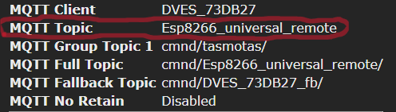

# Home Assistant Universal Remote

[](https://hacs.xyz/)

A Home Assistant custom integration for controlling universal IR/RF remotes using ESPHome or Tasmota devices via MQTT.

---

## Overview

**Universal Remote** brings seamless integration of IR and RF remote capabilities into Home Assistant. With support for ESPHome and Tasmota-based hardware, this integration allows you to send, receive, and automate IR/RF signals from a wide range of remotes, making it ideal for smart TVs, air conditioners, and other appliances.

---

## Features

- Works with ESPHome and Tasmota-based universal remotes.
- Sends IR and RF commands via Home Assistant services or automations.
- Supports both protocol-based and raw data IR/RF commands.
- YAML configuration for multiple remotes and backends.
- Compatible with MQTT for Tasmota devices.
- HACS-friendly for easy installation and updates.
- Learns and stores IR/RF codes for reuse.

---

## Installation

### 1. HACS (Recommended)

[](https://my.home-assistant.io/redirect/hacs_repository/?owner=omaramin-2000&repository=HA_universal_remote&category=integration)

1. Go to **HACS → Integrations → Custom repositories**.
2. Add your repo URL (e.g., `https://github.com/omaramin-2000/universal_remote`).
3. Set category as **Integration** and add.
4. Find "Universal Remote" in HACS integrations and install.
5. Restart Home Assistant.

### 2. Manual Installation

1. Download the `universal_remote` integration from this repository.
2. Copy the `custom_components/universal_remote` folder into your Home Assistant `custom_components` directory.
3. Restart Home Assistant.

---

## Configuration

Add your remote setup to `configuration.yaml`:

```yaml
remote:
    # ESPHOME
  - platform: universal_remote
    name: "Living Room Remote"
    backend: esphome
    device: livingroom_ir
    
    # TASMOTA
  - platform: universal_remote
    name: "Bedroom Remote"
    backend: tasmota
    mqtt_topic: Esp8266_universal_remote
    tasmota_led_number: 2  # Use LedPower<x> for learning indicator
```

### Configuration Options

| Option        | Required | Description                                                                 |
|---------------|----------|-----------------------------------------------------------------------------|
| `platform`    | Yes      | Must be `universal_remote`                                                  |
| `name`        | Yes      | Friendly name for your remote                                               |
| `backend`     | Yes      | Either `esphome` or `tasmota`                                               |
| `device`      | Yes\*    | ESPHome device name (required for ESPHome backend)                          |
| `mqtt_topic`  | Yes\*    | MQTT topic for Tasmota device (required for Tasmota backend)                |
| `led_entity_id`| No      | Optional LED entity to indicate remote status (for Tasmota backend only)    |

\* Only one of `device` or `mqtt_topic` is required, depending on the backend.

### How to Find Your Tasmota MQTT Topic

To control your Tasmota device, you need to know its **MQTT Topic**.  
You can find this in the Tasmota web interface:

1. Open your Tasmota device’s web UI in your browser.
2. Go to **Information**.
3. Look for the field labeled **MQTT Topic**.

This is the value you should use for `mqtt_topic` in your Home Assistant configuration.

**Example screenshot:**



In this example, the MQTT Topic is `Esp8266_universal_remote`.

Use this value in your configuration:

```yaml
  - platform: universal_remote
    name: "Bedroom Remote"
    backend: tasmota
    mqtt_topic: Esp8266_universal_remote
    led_entity_id: light.bedroom_remote_led  # Optional: entity to turn on during learning    
```

---

## Usage

### Sending Commands

You can send IR or RF commands using the `remote.send_command` service in Home Assistant.

#### For Tasmota

- **IR Example (protocol-based):**

  ```yaml
  service: remote.send_command
  target:
    entity_id: remote.bedroom_remote
  data:
    command:
      - '{"Protocol":"SAMSUNG","Bits":32,"Data":"0xE0E040BF"}'
  ```

- **IR Example (raw):**

  ```yaml
  service: remote.send_command
  target:
    entity_id: remote.bedroom_remote
  data:
    command:
      - '9000,4500,560,560,560,560,560,1690,560,560,560,560,560,560,560,560,560,560'
  ```

- **RF Example (protocol-based):**

  ```yaml
  service: remote.send_command
  target:
    entity_id: remote.bedroom_remote
  data:
    command:
      - '{"RfSync":12340,"RfLow":420,"RfHigh":1240,"RfCode":"0x123456"}'
  ```

#### For ESPHome

- **IR or RF Example:**

  ```yaml
  service: remote.send_command
  target:
    entity_id: remote.living_room_remote
  data:
    command:
      - "0xE0E040BF"
  ```

  > The format and interpretation of the command depend on your ESPHome YAML configuration.  
  > You can pass protocol-based or raw codes as strings, but your ESPHome device must be set up to handle them.

---

### Learning Commands

You can use the `remote.learn_command` service to learn IR or RF codes. The learned codes are stored in `/config/.storage/universal_remote_LEARNED_codes` and can be reused.

#### Example:

```yaml
service: remote.learn_command
target:
  entity_id: remote.bedroom_remote
data:
  command:
    - "power"
```

- Follow your device's instructions to put it in learning mode (e.g., point your remote and press the button).
- The code will be saved and can be sent later using `remote.send_command`.

---

## Notes & Tips

- **Tasmota:**  
  - The integration automatically detects whether to use `IRSend` or `RfSend` based on your command payload.
  - You do **not** need to specify the topic; just provide the correct JSON or raw string.

- **ESPHome:**  
  - You must define the corresponding `send` and `learn` services in your ESPHome YAML.
  - The integration passes the command string to ESPHome; your ESPHome config must know how to interpret it.

- **Multiple Remotes:**  
  - You can define as many remotes as you want, each with its own backend and configuration.

- **Supported Formats:**  
  - Protocol-based (e.g., NEC, SAMSUNG, etc.) and raw data for both IR and RF are supported.
  - For Tasmota, see [Tasmota IR Docs](https://tasmota.github.io/docs/Tasmota-IR/) and [Tasmota RF Docs](https://tasmota.github.io/docs/RF-Protocol/).

---

## Troubleshooting

- If commands are not working, check your device logs and ensure your payload matches what your hardware expects.
- For ESPHome, verify your YAML configuration for the remote transmitter/receiver.
- For Tasmota, ensure your device is online and the MQTT topic is correct.

---

## Example ESPHome YAML Snippet

Below is a **generic example** for ESPHome that allows sending and learning any IR or RF code, without requiring a specific protocol.  
This approach works with most IR/RF devices and is compatible with the universal remote integration.

```yaml
remote_transmitter:
  pin: GPIOXX
  carrier_duty_percent: 50%

remote_receiver:
  pin: GPIOXX
  dump: all
  buffer_size: 4kb

output:
  - platform: gpio
    pin: GPIOXX
    id: status_led_output

light:
  - platform: binary
    name: "Status LED"
    output: status_led_output
    id: led_indicator

api:
  services:
    - service: learning_started
      then:
        - light.turn_on: led_indicator
    - service: learning_ended
      then:
        - light.turn_off: led_indicator
    - service: send
      variables:
        command: string
      then:
        - remote_transmitter.transmit_raw:
            code: !lambda |-
              std::vector<uint32_t> out;
              for (auto s : split(command, ',')) {
                out.push_back(parse_number<uint32_t>(s));
              }
              return out;
    - service: learn
      then:
        # Optionally, you can add actions here if needed when learning starts
        - logger.log: "Learning mode started"
```

- **Sending:**  
  The `send` service expects a comma-separated string of raw timings (as learned or provided by your integration).
- **Learning:**  
  The `learn` service can be used to trigger an indicator (like an LED) or any other action you want when learning mode is started from Home Assistant.  
  **Note:** ESPHome automatically dumps received IR/RF codes to the logs when `dump: all` is set. You can view these codes in the ESPHome logs and use them in Home Assistant.

> Adjust the `pin` numbers and actions to match your hardware.  
> For advanced protocol support, see the [ESPHome Remote Transmitter docs](https://esphome.io/components/remote_transmitter.html).

---

## Questions?

Open an issue on GitHub or ask in the [Home Assistant Community](https://community.home-assistant.io/).
